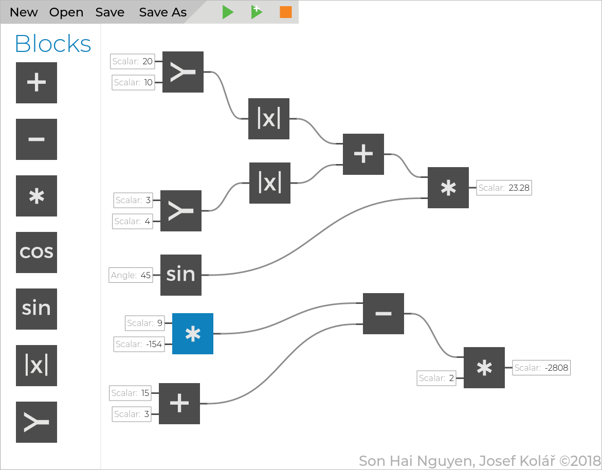

# Blokový editor
Aplikace slouží jako editor blokových schémat, kde každý blok obsahuje vstupní porty s definovaným typem a výstupní port s typem.
Vstupní porty jdou následně připojit do výstupních portů jiných bloků, samozřejmě dle shodujícího se typu.
Do každého vstupního portu lze buď připojit jiný port, nebo přímo zapsat vstupní hodnotu. 

## Instalace
Po rozbalení archivu stačí zavolat `make` pro sestavení, respektive `make run` poté pro spuštění.
Vzhledem ke specifickému prostředí na serveru Merlin jsou absolutní cesty zadány v souboru `Makefile`.
_Pro lokální spouštění je nutné upravit cesty ke Qt ve zmíněném souboru - včetně souboru `qt.conf`._

## Autoři:
Josef Kolář xkolar71
Son Hai Nguyen xnguye16